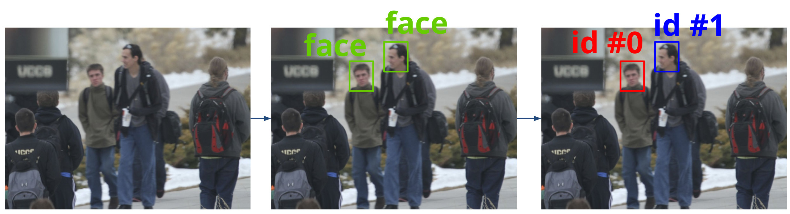

# Topcoder: Neptune - Facial Detection and Face Re-identification Marathon Match

## Problems
* [Facial Detection](https://topcoder.com/challenges/30086997)
* [Face Re-identification](https://topcoder.com/challenges/30086998)


## Solution
[[presentation]](figures/solution.pdf) [[video]](https://youtu.be/pdIf4qy3ypE)

## Build
```bash
make build
make run
```

## How to run? 
```bash
bash train.sh /data/training/
bash test.sh /data/test/ solution.csv
```

## References
* https://github.com/open-mmlab/mmdetection